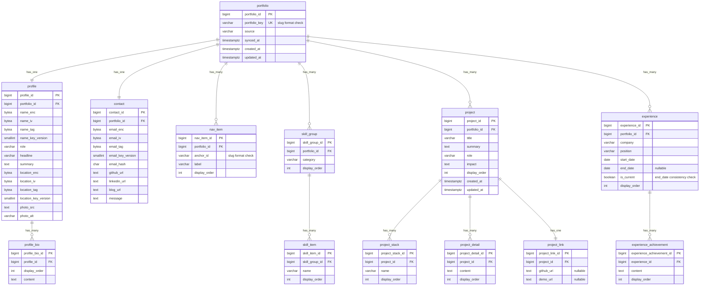

# 이슈 #5: 데이터베이스 스키마 설계안 (초안)

## 목적
- 이슈 `#5`의 요구사항(테이블 설계, 외래키, 인덱스, 노출 순서 컬럼, ERD/SQL 제약조건 확정)을 충족한다.
- 이슈 `#4`에서 확정된 `GET /api/v1/portfolio` 계약(`docs/api-spec.md`)을 DB 레벨로 매핑한다.

## DBMS 기준
- 본 설계의 기준 DBMS는 **PostgreSQL 17 이상(>= 17)** 이다.
- 문서의 자료형/제약조건/인덱스 전략은 PostgreSQL 17+ 동작 기준으로 작성한다.
- 하위 버전 호환은 본 문서의 기본 범위에 포함하지 않는다.

## 참고
- 이슈 #4: https://github.com/chan0e/portfolio-api/issues/4
- API 명세: `docs/api-spec.md` (commit `0ce2ff8`)
- 프론트 필드 레퍼런스:
  - https://github.com/chan0e/react-portfolio/blob/master/docs/portfolio-api-field-reference.md
  - `react-portfolio/src/types/portfolio.ts`

## 설계 원칙
- 1차 전환 기준: 프론트 응답 shape를 깨지지 않게 유지한다.
- 계약 우선: API 필수 필드는 DB에서 `NOT NULL`로 강제한다.
- 정렬 보장: 리스트성 데이터는 `display_order`를 기본 정렬 기준으로 둔다.
- 확장 여지: 향후 다중 포트폴리오/다국어/공개여부를 확장할 수 있게 루트 테이블을 둔다.

## 사전 확인 체크리스트 (무엇을 먼저 확정할지)
- 입력 기준 문서: `docs/api-spec.md`, `docs/issue-2-breakdown.md`, `skill/db-architecture-agent-rules/db-design-SKILL.md`
- 조회 패턴 기준: v1의 핵심 read path는 `GET /api/v1/portfolio` 단건 응답이며, 리스트성 데이터는 모두 순서 보장이 필요하다.
- 정렬 정책 확정: `navItems`, `skills`, `projects`, `experience` 및 하위 배열은 `display_order` 오름차순을 기본으로 한다.
- 카디널리티 확정: `portfolio-profile/contact`는 1:1, 나머지 섹션은 1:N으로 분해한다.
- 무결성 경계 확정: 부모 삭제 시 자식 정리는 `ON DELETE CASCADE`로 통일한다.
- 민감정보 경계 확정: `profile.name`, `profile.location`, `contact.email`은 필드 단위 암호화 + 키버전 추적을 적용한다.
- 운영 제약 확인: 현재 `spring.jpa.hibernate.ddl-auto=update` 상태이므로 운영 반영 전 마이그레이션 기반(Flyway/Liquibase) 전환 계획이 필요하다.
- 성능 기준 확인: MVP 단계에서는 PK/UK 중심 인덱스를 우선하고, 실측 병목 확인 후 보조 인덱스를 추가한다.

## 엔티티/동사 도출 (실무 관점)
### 엔티티(명사) 도출
| 구분 | 엔티티 | 근거(API/도메인) | 저장 책임 |
|---|---|---|---|
| 루트 | `portfolio` | 전체 포트폴리오 응답의 집합 루트 | 소스/동기화 시각/상위 키 관리 |
| 프로필 | `profile`, `profile_bio` | `profile` + `bio[]` | 단일 프로필 + 다건 소개문 저장 |
| 네비게이션 | `nav_item` | `navItems[]` | 섹션 anchor 및 노출 순서 관리 |
| 기술스택 | `skill_group`, `skill_item` | `skills[].category/items[]` | 분류/기술항목 계층 관리 |
| 프로젝트 | `project`, `project_stack`, `project_detail`, `project_link` | `projects[]` | 프로젝트 본문/스택/상세/링크 분리 저장 |
| 경력 | `experience`, `experience_achievement` | `experience[]` | 경력 본문/성과 목록 저장 |
| 연락처 | `contact` | `contact` | 공개 연락처 + 이메일 보호 저장 |

### 동사(행위/규칙) 도출
| 동사 | 설명 | DB 반영 방식 |
|---|---|---|
| 수집한다(sync) | 외부 소스(Notion 등)에서 포트폴리오를 동기화한다 | `portfolio.synced_at`, `portfolio.source` |
| 조회한다(read) | 프론트가 단일 API로 전체 데이터를 읽는다 | 루트 기준 1:1/1:N 조합 조회 |
| 정렬한다(order) | 목록 응답의 순서를 고정한다 | `display_order`, `UNIQUE(parent_id, display_order)` |
| 분해한다(normalize) | 배열 필드를 자식 테이블로 분리한다 | `profile_bio`, `skill_item`, `project_*`, `experience_achievement` |
| 중복방지한다(deduplicate) | 동일 범위 내 중복 레코드를 막는다 | `UNIQUE` 제약과 표현식 유니크 인덱스(예: `portfolio_id + anchor_id`, `portfolio_id + category`, `portfolio_id + company + position + start_date + coalesce(end_date, ...)`) |
| 보호한다(protect) | 개인정보를 평문 저장하지 않는다 | `*_enc/*_iv/*_tag/*_key_version`, `email_hash` |
| 삭제전파한다(cascade) | 부모 삭제 시 고아 데이터 방지 | FK + `ON DELETE CASCADE` |
| 검증한다(validate) | 비정상 데이터 입력을 차단한다 | `NOT NULL`, `CHECK`, 타입/길이 제한 |

## DB 설계 3단계 적용 (개념적/논리적/물리적)
### 1) 개념적 설계 (Conceptual)
- 목표: 비즈니스 용어 중심으로 데이터 경계를 정의한다.
- 핵심 개체: Portfolio, Profile, Navigation, Skill, Project, Experience, Contact.
- 핵심 관계: Portfolio는 여러 섹션을 포함하고, 각 섹션은 목록 항목을 포함한다.
- 핵심 규칙: API 응답 shape를 깨지 않는 범위에서 섹션 단위 독립성과 순서 보장을 유지한다.

### 2) 논리적 설계 (Logical)
- 목표: RDB 모델(테이블/관계/제약)로 변환한다.
- 식별자 표기: 논리 모델 문서에서는 모든 PK를 `테이블명_id` 형식으로 정의한다.
- FK 표기: 자식 테이블은 부모 PK명을 그대로 참조하는 `*_id`를 FK로 사용한다.
- 관계 모델:
  - 1:1: `portfolio-profile`, `portfolio-contact`, `project-project_link`
  - 1:N: `portfolio-nav_item/skill_group/project/experience`, `profile-profile_bio`, `skill_group-skill_item`, `project-project_stack/project_detail`, `experience-experience_achievement`
- 무결성 규칙:
  - 필수 필드 `NOT NULL`
  - 범위 유니크 `UNIQUE(parent_id, business_key or display_order)`
  - 순서 유효성 `CHECK(display_order >= 0)`
  - 부모-자식 생명주기 정합 `ON DELETE CASCADE`

#### 논리 엔티티 매핑 (개념 -> 논리)
| 개념 엔티티 | 논리 테이블 |
|---|---|
| Portfolio | `portfolio` |
| Profile | `profile`, `profile_bio` |
| Navigation | `nav_item` |
| Skill | `skill_group`, `skill_item` |
| Project | `project`, `project_stack`, `project_detail`, `project_link` |
| Experience | `experience`, `experience_achievement` |
| Contact | `contact` |

#### 논리 스키마 상세 (PK/FK/속성 필드)
| 테이블 | PK | FK | 속성 필드(비식별) |
|---|---|---|---|
| `portfolio` | `portfolio_id` | - | `portfolio_key`, `source`, `synced_at`, `created_at`, `updated_at` |
| `profile` | `profile_id` | `portfolio_id -> portfolio.portfolio_id` | `name_enc`, `name_iv`, `name_tag`, `name_key_version`, `role`, `headline`, `summary`, `location_enc`, `location_iv`, `location_tag`, `location_key_version`, `photo_src`, `photo_alt`, `created_at`, `updated_at` |
| `profile_bio` | `profile_bio_id` | `profile_id -> profile.profile_id` | `display_order`, `content` |
| `nav_item` | `nav_item_id` | `portfolio_id -> portfolio.portfolio_id` | `anchor_id`, `label`, `display_order`, `created_at`, `updated_at` |
| `skill_group` | `skill_group_id` | `portfolio_id -> portfolio.portfolio_id` | `category`, `display_order`, `created_at`, `updated_at` |
| `skill_item` | `skill_item_id` | `skill_group_id -> skill_group.skill_group_id` | `name`, `display_order` |
| `project` | `project_id` | `portfolio_id -> portfolio.portfolio_id` | `title`, `summary`, `role`, `impact`, `display_order`, `created_at`, `updated_at` |
| `project_stack` | `project_stack_id` | `project_id -> project.project_id` | `name`, `display_order` |
| `project_detail` | `project_detail_id` | `project_id -> project.project_id` | `content`, `display_order` |
| `project_link` | `project_link_id` | `project_id -> project.project_id` | `github_url`, `demo_url` |
| `experience` | `experience_id` | `portfolio_id -> portfolio.portfolio_id` | `company`, `position`, `start_date`, `end_date`, `is_current`, `display_order`, `created_at`, `updated_at` |
| `experience_achievement` | `experience_achievement_id` | `experience_id -> experience.experience_id` | `content`, `display_order` |
| `contact` | `contact_id` | `portfolio_id -> portfolio.portfolio_id` | `email_enc`, `email_iv`, `email_tag`, `email_key_version`, `email_hash`, `github_url`, `linkedin_url`, `blog_url`, `message`, `created_at`, `updated_at` |

#### 논리 제약 메모 (DDL 직전 확인)
- 1:1 관계 FK(`profile.portfolio_id`, `contact.portfolio_id`, `project_link.project_id`)는 `UNIQUE`로 강제한다.
- 배열성 하위 테이블(`*_bio`, `*_item`, `*_stack`, `*_detail`, `*_achievement`)은 `UNIQUE(parent_id, display_order)`를 기본 적용한다.
- 동등 레벨 중복 방지는 도메인 키 조합 또는 표현식 유니크 인덱스로 제약한다.
  - 예: `UNIQUE(portfolio_id, anchor_id)`, `UNIQUE(portfolio_id, category)`, `UNIQUE(project_id, name)`, `UNIQUE INDEX ... COALESCE(end_date, DATE '9999-12-31')`

#### 카디널리티 설정 근거와 예시 시나리오
| 관계 | 카디널리티 | 설정 근거 | 예시 상황 |
|---|---|---|---|
| `portfolio - profile` | 1:1 | API 응답의 `profile`은 단일 객체이며 배열이 아니다 | 사용자가 포트폴리오를 조회할 때 자기 소개는 항상 1개 블록으로 내려간다 |
| `portfolio - contact` | 1:1 | API 응답의 `contact`도 단일 객체로 정의되어 있다 | 연락 섹션은 이메일/링크/메시지 묶음 1세트만 노출한다 |
| `project - project_link` | 1:1 | 각 프로젝트의 `links`는 단일 객체(`github`, `demo`) 구조다 | 프로젝트 A는 깃허브 1개와 데모 0~1개를 가진다 |
| `portfolio - nav_item` | 1:N | `navItems[]`가 배열이며 순서 노출이 필요하다 | Home/About/Projects/Contact 메뉴가 여러 개 존재한다 |
| `portfolio - skill_group` | 1:N | `skills[]`는 카테고리 반복 구조다 | Backend/Frontend/DevOps 카테고리가 동시에 존재한다 |
| `skill_group - skill_item` | 1:N | 카테고리별 기술 항목이 다건이다 | Backend 카테고리에 Java/Spring/PostgreSQL이 포함된다 |
| `portfolio - project` | 1:N | `projects[]`는 포트폴리오 핵심 목록이다 | 운영 중인 프로젝트가 3~10건으로 늘어날 수 있다 |
| `project - project_stack` | 1:N | 한 프로젝트는 여러 기술 스택을 가진다 | 프로젝트 A가 Java, Spring Boot, Redis를 함께 사용한다 |
| `project - project_detail` | 1:N | 상세 설명은 문단/불릿 여러 줄로 구성된다 | 문제/해결/성과를 3개 항목으로 분리해 저장한다 |
| `portfolio - experience` | 1:N | `experience[]`는 경력 이력 목록이다 | 회사 이직/프로젝트 이력으로 여러 경력 레코드가 생긴다 |
| `experience - experience_achievement` | 1:N | 경력별 성과는 복수 개가 일반적이다 | 특정 회사 경력에 성과 항목 4개를 기술한다 |
| `profile - profile_bio` | 1:N | `profile.bio`는 `string[]`로 정의된 배열이다 | 소개 문장을 2~4개의 문단으로 나눠 관리한다 |

#### 카디널리티 검증 결과 (2차)
- API 계약 재확인(`docs/api-spec.md`)
  - 단일 객체: `profile`, `contact`, `projects[].links`
  - 배열 필드: `navItems[]`, `skills[]`, `projects[]`, `projects[].stack[]`, `projects[].details[]`, `experience[]`, `experience[].achievements[]`, `profile.bio[]`
- 요구사항 문서 재확인(`docs/issue-2-breakdown.md`)
  - v1 범위가 `GET /api/v1/portfolio` 단일 응답 중심이며, 섹션별 리스트 데이터를 포함하도록 정의되어 있다.
- 프론트 계약 참고 재확인
  - `react-portfolio` 필드 레퍼런스/타입 정의와 동일한 응답 shape 유지를 전제로 설계한다.
- 결론
  - 현재 문서의 IE 카디널리티(`||--||`, `||--o{`)는 API 계약 및 요구사항 문서와 정합하다.

### 3) 물리적 설계 (Physical, PostgreSQL 17+)
- 목표: 실제 운영 가능한 타입/인덱스/마이그레이션 정책으로 구체화한다.
- 타입 전략: `BIGINT IDENTITY`, `VARCHAR`, `TEXT`, `BYTEA`, `SMALLINT`, `TIMESTAMPTZ`, `CHAR(64)`, `DATE`, `BOOLEAN` 사용.
- 인덱스 전략: PK/UK 자동 인덱스 우선, 보조 인덱스는 실측(`EXPLAIN ANALYZE`) 근거로 추가.
- 암호화 저장 전략: 민감 필드는 애플리케이션 계층 암복호화, 키는 KMS/Vault 관리.
- 배포 전략:
  - 현재 개발 단계는 JPA 자동 스키마 업데이트를 사용하되, 운영 전환 시 마이그레이션 도구로 명시적 DDL 관리 전환
  - 제약조건 이름 고정으로 롤백/장애 분석 추적성 확보
  - `updated_at` 갱신은 DB 트리거 대신 애플리케이션 계층에서 일관되게 처리
- 검증 전략: API DTO-DB 매핑 통합 테스트에서 `null/빈배열/중복순서/고아레코드`를 케이스화한다.

## ERD

- 시각화 파일: `docs/assets/issue-5-erd.png`
- 관계 표기: Crow's Foot Notation (IE)
  - `||` = exactly one
  - `|{` = one or many
  - `o|` = zero or one
  - `o{` = zero or many
- 참고: 실제 DDL에서는 PK를 `BIGINT GENERATED BY DEFAULT AS IDENTITY`로 사용한다.

## DDL 동기화 변경사항 (revised)
- 기준 스크립트: `docs/issue-5-logical-model-ddl.sql`
- 이번 반영 핵심
  - 식별자 명명: `id` 단일명 대신 `테이블명_id`로 통일
  - 경력 모델 변경: `experience.period` -> `start_date/end_date/is_current`
  - 핵심 문자열 공백 방지: `CHECK (btrim(field) <> '')` 적용 확대
  - 링크 정책 변경: `project_link`는 `github_url`/`demo_url` 중 최소 1개 필수
  - 암호문 보강: `*_enc` 컬럼에 `octet_length(...) > 0` 체크 추가
  - slug 제약: `portfolio_key`, `nav_item.anchor_id` 형식 제약 추가
  - 기본값 반영: `portfolio.source`, `*_key_version`, `experience.is_current`에 DDL 기본값 반영
  - 경력 중복 방지 방식 변경: `experience`는 NULL 안전성을 위해 표현식 유니크 인덱스 `uk_experience_portfolio_identity` 사용
  - 프로젝트 제약 정리: `project`는 현재 `title` 유니크 없이 `display_order`만 유니크로 강제
  - 갱신 정책 변경: `updated_at`은 DB 트리거를 제거하고 애플리케이션 계층에서 관리

## 테이블 설계 (DDL 기준)
### 1) `portfolio`
- PK: `portfolio_id BIGINT GENERATED BY DEFAULT AS IDENTITY`
- 주요 컬럼: `portfolio_key`, `source`, `synced_at`, `created_at`, `updated_at`
- 핵심 제약
  - `source DEFAULT 'notion'`
  - `UNIQUE(portfolio_key)`
  - `CHECK (btrim(portfolio_key) <> '')`
  - `CHECK (portfolio_key ~ '^[a-z0-9_-]{1,50}$')`

### 2) `profile`
- PK: `profile_id`
- FK: `portfolio_id -> portfolio(portfolio_id)` (`UNIQUE`, `ON DELETE CASCADE`)
- 주요 컬럼: `name_*`, `role`, `headline`, `summary`, `location_*`, `photo_src`, `photo_alt`, `created_at`, `updated_at`
- 핵심 제약
  - `name_key_version DEFAULT 1`, `location_key_version DEFAULT 1`
  - 암호화 메타 길이: `name_iv/name_tag`, `location_iv/location_tag`
  - 암호문 비어있음 금지: `CHECK (octet_length(name_enc) > 0)`, `CHECK (octet_length(location_enc) > 0)`
  - 핵심 문자열 공백 금지: `role/headline/summary/photo_src/photo_alt`

### 3) `profile_bio`
- PK: `profile_bio_id`
- FK: `profile_id -> profile(profile_id)` (`ON DELETE CASCADE`)
- 주요 컬럼: `display_order`, `content`
- 핵심 제약
  - `UNIQUE(profile_id, display_order)`
  - `CHECK(display_order >= 0)`
  - `CHECK (btrim(content) <> '')`

### 4) `nav_item`
- PK: `nav_item_id`
- FK: `portfolio_id -> portfolio(portfolio_id)` (`ON DELETE CASCADE`)
- 주요 컬럼: `anchor_id`, `label`, `display_order`, `created_at`, `updated_at`
- 핵심 제약
  - `UNIQUE(portfolio_id, anchor_id)`
  - `UNIQUE(portfolio_id, display_order)`
  - `CHECK(display_order >= 0)`
  - `CHECK (btrim(anchor_id) <> '')`
  - `CHECK (anchor_id ~ '^[a-z0-9_-]{1,50}$')`
  - `CHECK (btrim(label) <> '')`

### 5) `skill_group`
- PK: `skill_group_id`
- FK: `portfolio_id -> portfolio(portfolio_id)` (`ON DELETE CASCADE`)
- 주요 컬럼: `category`, `display_order`, `created_at`, `updated_at`
- 핵심 제약
  - `UNIQUE(portfolio_id, category)`
  - `UNIQUE(portfolio_id, display_order)`
  - `CHECK(display_order >= 0)`
  - `CHECK (btrim(category) <> '')`

### 6) `skill_item`
- PK: `skill_item_id`
- FK: `skill_group_id -> skill_group(skill_group_id)` (`ON DELETE CASCADE`)
- 주요 컬럼: `name`, `display_order`
- 핵심 제약
  - `UNIQUE(skill_group_id, name)`
  - `UNIQUE(skill_group_id, display_order)`
  - `CHECK(display_order >= 0)`
  - `CHECK (btrim(name) <> '')`

### 7) `project`
- PK: `project_id`
- FK: `portfolio_id -> portfolio(portfolio_id)` (`ON DELETE CASCADE`)
- 주요 컬럼: `title`, `summary`, `role`, `impact`, `display_order`, `created_at`, `updated_at`
- 핵심 제약
  - `UNIQUE(portfolio_id, display_order)`
  - `CHECK(display_order >= 0)`
  - `CHECK (btrim(title) <> '')`
  - `CHECK (btrim(summary) <> '')`
  - `CHECK (btrim(role) <> '')`
  - `CHECK (btrim(impact) <> '')`

### 8) `project_stack`
- PK: `project_stack_id`
- FK: `project_id -> project(project_id)` (`ON DELETE CASCADE`)
- 주요 컬럼: `name`, `display_order`
- 핵심 제약
  - `UNIQUE(project_id, name)`
  - `UNIQUE(project_id, display_order)`
  - `CHECK(display_order >= 0)`
  - `CHECK (btrim(name) <> '')`

### 9) `project_detail`
- PK: `project_detail_id`
- FK: `project_id -> project(project_id)` (`ON DELETE CASCADE`)
- 주요 컬럼: `content`, `display_order`
- 핵심 제약
  - `UNIQUE(project_id, display_order)`
  - `CHECK(display_order >= 0)`
  - `CHECK (btrim(content) <> '')`

### 10) `project_link`
- PK: `project_link_id`
- FK: `project_id -> project(project_id)` (`UNIQUE`, `ON DELETE CASCADE`)
- 주요 컬럼: `github_url NULL`, `demo_url NULL`
- 핵심 제약
  - `CHECK ((github_url IS NOT NULL AND btrim(github_url) <> '') OR (demo_url IS NOT NULL AND btrim(demo_url) <> ''))`

### 11) `experience`
- PK: `experience_id`
- FK: `portfolio_id -> portfolio(portfolio_id)` (`ON DELETE CASCADE`)
- 주요 컬럼: `company`, `position`, `start_date`, `end_date`, `is_current`, `display_order`, `created_at`, `updated_at`
- 핵심 제약
  - `is_current DEFAULT FALSE`
  - `UNIQUE(portfolio_id, display_order)`
  - 표현식 유니크 인덱스: `uk_experience_portfolio_identity (portfolio_id, company, position, start_date, COALESCE(end_date, DATE '9999-12-31'))`
  - `CHECK(display_order >= 0)`
  - `CHECK (btrim(company) <> '')`, `CHECK (btrim(position) <> '')`
  - `CHECK ((is_current = TRUE AND end_date IS NULL) OR (is_current = FALSE AND end_date IS NOT NULL))`
  - `CHECK (end_date IS NULL OR start_date <= end_date)`

### 12) `experience_achievement`
- PK: `experience_achievement_id`
- FK: `experience_id -> experience(experience_id)` (`ON DELETE CASCADE`)
- 주요 컬럼: `content`, `display_order`
- 핵심 제약
  - `UNIQUE(experience_id, display_order)`
  - `CHECK(display_order >= 0)`
  - `CHECK (btrim(content) <> '')`

### 13) `contact`
- PK: `contact_id`
- FK: `portfolio_id -> portfolio(portfolio_id)` (`UNIQUE`, `ON DELETE CASCADE`)
- 주요 컬럼: `email_*`, `email_hash`, `github_url`, `linkedin_url`, `blog_url`, `message`, `created_at`, `updated_at`
- 핵심 제약
  - `email_key_version DEFAULT 1`
  - `CHECK(email_hash ~ '^[0-9a-f]{64}$')`
  - `CHECK(octet_length(email_iv) = 12 AND octet_length(email_tag) = 16)`
  - `CHECK(octet_length(email_enc) > 0)`
  - `CHECK (btrim(github_url) <> '')`
  - `CHECK (btrim(linkedin_url) <> '')`
  - `CHECK (btrim(blog_url) <> '')`
  - `CHECK (btrim(message) <> '')`

### 공통 `updated_at` 관리 정책
- DB 트리거는 두지 않는다.
- `updated_at`은 애플리케이션 계층에서 갱신한다.
- 이유: DB 스키마는 제약/무결성에 집중하고, 갱신 시점 제어는 서비스 로직에서 일관되게 처리한다.

## 개인정보/암호화 적용
| API 필드 | 개인정보 여부 | DB 저장 방식 | 비고 |
|---|---|---|---|
| `profile.name` | 예 | `name_enc/name_iv/name_tag` | AES-256-GCM 암호문 저장 |
| `profile.location` | 예 | `location_enc/location_iv/location_tag` | AES-256-GCM 암호문 저장 |
| `contact.email` | 예 | `email_enc/email_iv/email_tag` + `email_hash` | 복호화 조회 + 해시 검색 |
| `contact.message` | 아니오(공개 문구) | 평문 | 운영 정책 변경 시 암호화 전환 가능 |

- 암호화 키는 DB가 아닌 KMS/Vault에서 관리한다.
- 애플리케이션은 `*_key_version`으로 키 로테이션을 추적한다.
- 조회 API 응답 시 애플리케이션 계층에서 복호화 후 응답한다.

## 인덱스 설계
- 결론: 현재 프로젝트 성격(MVP, 단일 조회 API 중심) 기준으로 **명시적 보조 인덱스는 최소화**한다.
- 기본 전략
  - `PRIMARY KEY`/`UNIQUE` 제약으로 자동 생성되는 인덱스를 우선 활용한다.
  - `UNIQUE(portfolio_key)`로 `portfolio_key` 조회 성능은 충분히 확보된다.
  - `UNIQUE(..., display_order)` 제약이 있는 테이블은 정렬/조인에 필요한 선행 컬럼 인덱스를 이미 포함한다.
  - `experience`는 `end_date IS NULL` 케이스까지 중복 방지하려고 표현식 유니크 인덱스 `uk_experience_portfolio_identity`를 명시적으로 추가한다.
- 현 단계에서 추가 생성하지 않는 인덱스
  - `idx_*_portfolio_order`, `idx_*_project_order`류 보조 인덱스는 중복 가능성이 높아 보류한다.
  - `idx_contact_email_hash`는 이메일 검색 API가 생길 때까지 보류한다.
- 추가 기준 (후속 최적화)
  - 실제 트래픽 이후 `EXPLAIN (ANALYZE, BUFFERS)` 결과로 병목이 확인될 때만 추가한다.
  - 인덱스 추가 시 읽기 이득 대비 쓰기 비용(INSERT/UPDATE, VACUUM)을 함께 검토한다.

## API 필드 매핑 요약
- `profile.*` -> `profile` + `profile_bio`
  - `name` <- `name_enc` 복호화
  - `location` <- `location_enc` 복호화
- `navItems[]` -> `nav_item`
- `skills[]` -> `skill_group` + `skill_item`
- `projects[]` -> `project` + `project_stack` + `project_detail` + `project_link`
- `experience[]` -> `experience` + `experience_achievement`
  - `period` <- `start_date/end_date/is_current` 조합으로 응답 시 파생
- `contact.*` -> `contact`
  - `email` <- `email_enc` 복호화
- `meta.syncedAt/source` -> `portfolio.synced_at/source`

## PostgreSQL 제약조건 원칙
- 필수 필드: `NOT NULL`
- 정렬 필드: `CHECK(display_order >= 0)`
- 1:1 관계: `UNIQUE(portfolio_id)` 또는 `UNIQUE(project_id)`
- 자식 데이터 삭제: `ON DELETE CASCADE`
- 공백 문자열 금지(핵심 필드): `CHECK (btrim(field) <> '')`
- slug 형식 제약: `portfolio_key`, `anchor_id`는 정규식으로 형식 강제
- 링크 필드 제약: `project_link`는 github/demo 중 최소 1개 URL 필수
- 암호문 유효성: `*_enc`는 `octet_length(...) > 0`으로 빈 bytea 차단
- 경력 기간 정합성: `is_current`, `end_date`, `start_date` 조합 체크로 일관성 강제
- NULL 포함 경력 중복 방지: `COALESCE(end_date, DATE '9999-12-31')` 기반 표현식 유니크 인덱스 사용
- 개인정보 암호화 컬럼: `*_enc/*_iv/*_tag/*_key_version` 세트로 관리
- 개인정보 조회 보조: `email_hash`로 검색, 평문 검색 금지

## 점검 결과 (이슈 #5 기준)
- PostgreSQL 자료형 사용 여부: 충족
  - 핵심 타입: `BIGINT IDENTITY`, `BIGINT`, `VARCHAR`, `TEXT`, `BYTEA`, `SMALLINT`, `TIMESTAMPTZ`, `CHAR(64)`, `DATE`, `BOOLEAN`
  - Mermaid ERD도 PostgreSQL 계열 타입으로 정리 완료
- 관계 매핑 적절성: 충족
  - 루트 `portfolio` 기준으로 `profile/contact` 1:1(논리), `nav_item/skill_group/project/experience` 1:N
  - 배열형 필드(`bio/items/stack/details/achievements`)는 별도 자식 테이블로 1:N 분해
  - `project_link`는 `project_id UNIQUE`로 1:1 매핑 유지
  - 모든 자식 FK에 `ON DELETE CASCADE` 정책 적용
- DDL 강화 제약 반영: 완료
  - 공백 문자열 차단(`btrim`)과 slug 포맷 제약 반영
  - `portfolio.source`, `*_key_version`, `experience.is_current` 기본값 반영
  - `project_link` 최소 1개 URL 체크 반영
  - `project`는 `title` 유니크 없이 `display_order` 유니크만 유지하도록 문서와 동기화
  - `experience` 기간 모델 분리(`start_date/end_date/is_current`) 및 일관성 체크 반영
  - `experience`의 NULL 안전 중복 방지를 위해 표현식 유니크 인덱스 반영
  - `updated_at`은 DB 트리거 없이 애플리케이션 계층에서 관리하도록 정책 변경

## 오픈 포인트 (확인 필요)
- `portfolio`를 단일 row(`default`)로 고정할지, 다중 포트폴리오 지원할지
- URL 컬럼에 절대 URL 정규식까지 DB `CHECK`로 강제할지, 애플리케이션 검증으로 둘지
- `experience.period` 문자열 응답을 서버에서 파생 생성할지, API 계약을 날짜 필드 중심으로 개정할지

## 완료 기준
- 이 문서 기준으로 마이그레이션 이슈 `#6`의 DDL 작성이 가능해야 한다.
- 이슈 `#4`의 API 계약 필드가 누락 없이 매핑되어야 한다.
