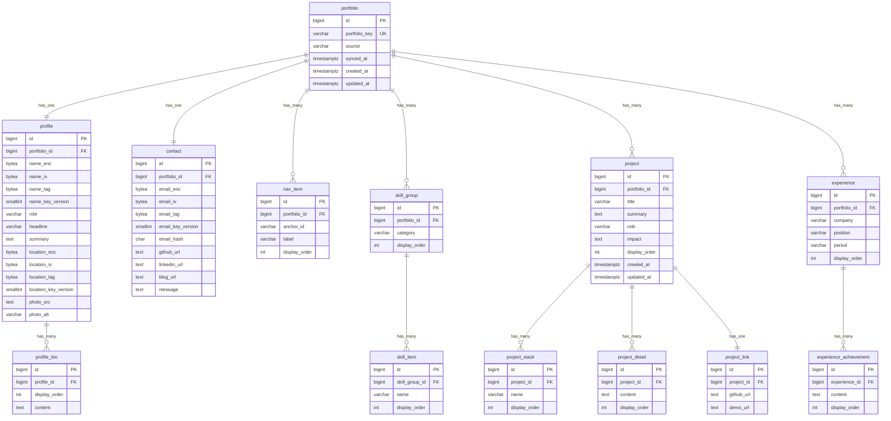

# 이슈 #5: 데이터베이스 스키마 설계안 (초안)

## 목적
- 이슈 `#5`의 요구사항(테이블 설계, 외래키, 인덱스, 노출 순서 컬럼, ERD/SQL 제약조건 확정)을 충족한다.
- 이슈 `#4`에서 확정된 `GET /api/v1/portfolio` 계약(`docs/api-spec.md`)을 DB 레벨로 매핑한다.

## DBMS 기준
- 본 설계의 기준 DBMS는 **PostgreSQL 17 이상(>= 17)** 이다.
- 문서의 자료형/제약조건/인덱스 전략은 PostgreSQL 17+ 동작 기준으로 작성한다.
- 하위 버전 호환은 본 문서의 기본 범위에 포함하지 않는다.

## 참고
- 이슈 #4: https://github.com/chan0e/portfolio-api/issues/4
- API 명세: `docs/api-spec.md` (commit `0ce2ff8`)
- 프론트 필드 레퍼런스:
  - https://github.com/chan0e/react-portfolio/blob/master/docs/portfolio-api-field-reference.md
  - `react-portfolio/src/types/portfolio.ts`

## 설계 원칙
- 1차 전환 기준: 프론트 응답 shape를 깨지지 않게 유지한다.
- 계약 우선: API 필수 필드는 DB에서 `NOT NULL`로 강제한다.
- 정렬 보장: 리스트성 데이터는 `display_order`를 기본 정렬 기준으로 둔다.
- 확장 여지: 향후 다중 포트폴리오/다국어/공개여부를 확장할 수 있게 루트 테이블을 둔다.

## ERD

- 시각화 파일: `docs/assets/issue-5-erd.png`
- 관계 표기: Crow's Foot Notation (IE)
  - `||` = exactly one
  - `|<` = one or many
  - `o|` = zero or one
  - `o<` = zero or many
- 참고: 실제 DDL에서는 PK를 `BIGINT GENERATED BY DEFAULT AS IDENTITY`로 사용한다.

## 테이블 설계
### 1) `portfolio`
- 용도: 전체 포트폴리오 집합의 루트 엔터티
- 주요 컬럼
  - `id BIGINT GENERATED BY DEFAULT AS IDENTITY PRIMARY KEY`
  - `portfolio_key VARCHAR(50) NOT NULL UNIQUE` (예: `default`)
  - `source VARCHAR(30) NOT NULL DEFAULT 'notion'`
  - `synced_at TIMESTAMPTZ NULL`
  - `created_at TIMESTAMPTZ NOT NULL DEFAULT CURRENT_TIMESTAMP`
  - `updated_at TIMESTAMPTZ NOT NULL DEFAULT CURRENT_TIMESTAMP`

### 2) `profile`
- 용도: 단일 프로필 정보
- 주요 컬럼
  - `id BIGINT GENERATED BY DEFAULT AS IDENTITY PRIMARY KEY`
  - `portfolio_id BIGINT NOT NULL UNIQUE REFERENCES portfolio(id) ON DELETE CASCADE`
  - `name_enc BYTEA NOT NULL`
  - `name_iv BYTEA NOT NULL`
  - `name_tag BYTEA NOT NULL`
  - `name_key_version SMALLINT NOT NULL DEFAULT 1`
  - `role VARCHAR(100) NOT NULL`
  - `headline VARCHAR(200) NOT NULL`
  - `summary TEXT NOT NULL`
  - `location_enc BYTEA NOT NULL`
  - `location_iv BYTEA NOT NULL`
  - `location_tag BYTEA NOT NULL`
  - `location_key_version SMALLINT NOT NULL DEFAULT 1`
  - `photo_src TEXT NOT NULL`
  - `photo_alt VARCHAR(200) NOT NULL`
  - `created_at/updated_at TIMESTAMPTZ NOT NULL DEFAULT CURRENT_TIMESTAMP`
- 제약
  - `CHECK(octet_length(name_iv) = 12 AND octet_length(name_tag) = 16)`
  - `CHECK(octet_length(location_iv) = 12 AND octet_length(location_tag) = 16)`

### 3) `profile_bio`
- 용도: `profile.bio: string[]`를 순서 보장으로 저장
- 주요 컬럼
  - `id BIGINT GENERATED BY DEFAULT AS IDENTITY PRIMARY KEY`
  - `profile_id BIGINT NOT NULL REFERENCES profile(id) ON DELETE CASCADE`
  - `display_order INT NOT NULL`
  - `content TEXT NOT NULL`
- 제약
  - `UNIQUE(profile_id, display_order)`
  - `CHECK(display_order >= 0)`

### 4) `nav_item`
- 용도: `navItems[]`
- 주요 컬럼
  - `id BIGINT GENERATED BY DEFAULT AS IDENTITY PRIMARY KEY`
  - `portfolio_id BIGINT NOT NULL REFERENCES portfolio(id) ON DELETE CASCADE`
  - `anchor_id VARCHAR(50) NOT NULL` (`hero`, `about` 등)
  - `label VARCHAR(50) NOT NULL`
  - `display_order INT NOT NULL`
  - `created_at/updated_at TIMESTAMPTZ NOT NULL DEFAULT CURRENT_TIMESTAMP`
- 제약
  - `UNIQUE(portfolio_id, anchor_id)`
  - `UNIQUE(portfolio_id, display_order)`
  - `CHECK(display_order >= 0)`

### 5) `skill_group`
- 용도: `skills[].category`
- 주요 컬럼
  - `id BIGINT GENERATED BY DEFAULT AS IDENTITY PRIMARY KEY`
  - `portfolio_id BIGINT NOT NULL REFERENCES portfolio(id) ON DELETE CASCADE`
  - `category VARCHAR(80) NOT NULL`
  - `display_order INT NOT NULL`
  - `created_at/updated_at TIMESTAMPTZ NOT NULL DEFAULT CURRENT_TIMESTAMP`
- 제약
  - `UNIQUE(portfolio_id, category)`
  - `UNIQUE(portfolio_id, display_order)`
  - `CHECK(display_order >= 0)`

### 6) `skill_item`
- 용도: `skills[].items[]`
- 주요 컬럼
  - `id BIGINT GENERATED BY DEFAULT AS IDENTITY PRIMARY KEY`
  - `skill_group_id BIGINT NOT NULL REFERENCES skill_group(id) ON DELETE CASCADE`
  - `name VARCHAR(80) NOT NULL`
  - `display_order INT NOT NULL`
- 제약
  - `UNIQUE(skill_group_id, name)`
  - `UNIQUE(skill_group_id, display_order)`
  - `CHECK(display_order >= 0)`

### 7) `project`
- 용도: `projects[]` 기본 필드
- 주요 컬럼
  - `id BIGINT GENERATED BY DEFAULT AS IDENTITY PRIMARY KEY`
  - `portfolio_id BIGINT NOT NULL REFERENCES portfolio(id) ON DELETE CASCADE`
  - `title VARCHAR(150) NOT NULL`
  - `summary TEXT NOT NULL`
  - `role VARCHAR(120) NOT NULL`
  - `impact TEXT NOT NULL`
  - `display_order INT NOT NULL`
  - `created_at/updated_at TIMESTAMPTZ NOT NULL DEFAULT CURRENT_TIMESTAMP`
- 제약
  - `UNIQUE(portfolio_id, title)`
  - `UNIQUE(portfolio_id, display_order)`
  - `CHECK(display_order >= 0)`

### 8) `project_stack`
- 용도: `projects[].stack[]`
- 주요 컬럼
  - `id BIGINT GENERATED BY DEFAULT AS IDENTITY PRIMARY KEY`
  - `project_id BIGINT NOT NULL REFERENCES project(id) ON DELETE CASCADE`
  - `name VARCHAR(80) NOT NULL`
  - `display_order INT NOT NULL`
- 제약
  - `UNIQUE(project_id, name)`
  - `UNIQUE(project_id, display_order)`
  - `CHECK(display_order >= 0)`

### 9) `project_detail`
- 용도: `projects[].details[]` (optional)
- 주요 컬럼
  - `id BIGINT GENERATED BY DEFAULT AS IDENTITY PRIMARY KEY`
  - `project_id BIGINT NOT NULL REFERENCES project(id) ON DELETE CASCADE`
  - `content TEXT NOT NULL`
  - `display_order INT NOT NULL`
- 제약
  - `UNIQUE(project_id, display_order)`
  - `CHECK(display_order >= 0)`

### 10) `project_link`
- 용도: `projects[].links`
- 주요 컬럼
  - `id BIGINT GENERATED BY DEFAULT AS IDENTITY PRIMARY KEY`
  - `project_id BIGINT NOT NULL UNIQUE REFERENCES project(id) ON DELETE CASCADE`
  - `github_url TEXT NOT NULL`
  - `demo_url TEXT NULL`
- 제약
  - `CHECK(github_url <> '')`

### 11) `experience`
- 용도: `experience[]` 기본 필드
- 주요 컬럼
  - `id BIGINT GENERATED BY DEFAULT AS IDENTITY PRIMARY KEY`
  - `portfolio_id BIGINT NOT NULL REFERENCES portfolio(id) ON DELETE CASCADE`
  - `company VARCHAR(150) NOT NULL`
  - `position VARCHAR(120) NOT NULL`
  - `period VARCHAR(80) NOT NULL` (예: `2024.01 - 현재`)
  - `display_order INT NOT NULL`
  - `created_at/updated_at TIMESTAMPTZ NOT NULL DEFAULT CURRENT_TIMESTAMP`
- 제약
  - `UNIQUE(portfolio_id, company, position, period)`
  - `UNIQUE(portfolio_id, display_order)`
  - `CHECK(display_order >= 0)`

### 12) `experience_achievement`
- 용도: `experience[].achievements[]`
- 주요 컬럼
  - `id BIGINT GENERATED BY DEFAULT AS IDENTITY PRIMARY KEY`
  - `experience_id BIGINT NOT NULL REFERENCES experience(id) ON DELETE CASCADE`
  - `content TEXT NOT NULL`
  - `display_order INT NOT NULL`
- 제약
  - `UNIQUE(experience_id, display_order)`
  - `CHECK(display_order >= 0)`

### 13) `contact`
- 용도: `contact`
- 주요 컬럼
  - `id BIGINT GENERATED BY DEFAULT AS IDENTITY PRIMARY KEY`
  - `portfolio_id BIGINT NOT NULL UNIQUE REFERENCES portfolio(id) ON DELETE CASCADE`
  - `email_enc BYTEA NOT NULL`
  - `email_iv BYTEA NOT NULL`
  - `email_tag BYTEA NOT NULL`
  - `email_key_version SMALLINT NOT NULL DEFAULT 1`
  - `email_hash CHAR(64) NOT NULL`
  - `github_url TEXT NOT NULL`
  - `linkedin_url TEXT NOT NULL`
  - `blog_url TEXT NOT NULL`
  - `message TEXT NOT NULL`
  - `created_at/updated_at TIMESTAMPTZ NOT NULL DEFAULT CURRENT_TIMESTAMP`
- 제약
  - `CHECK(email_hash ~ '^[0-9a-f]{64}$')`
  - `CHECK(octet_length(email_iv) = 12 AND octet_length(email_tag) = 16)`

## 개인정보/암호화 적용
| API 필드 | 개인정보 여부 | DB 저장 방식 | 비고 |
|---|---|---|---|
| `profile.name` | 예 | `name_enc/name_iv/name_tag` | AES-256-GCM 암호문 저장 |
| `profile.location` | 예 | `location_enc/location_iv/location_tag` | AES-256-GCM 암호문 저장 |
| `contact.email` | 예 | `email_enc/email_iv/email_tag` + `email_hash` | 복호화 조회 + 해시 검색 |
| `contact.message` | 아니오(공개 문구) | 평문 | 운영 정책 변경 시 암호화 전환 가능 |

- 암호화 키는 DB가 아닌 KMS/Vault에서 관리한다.
- 애플리케이션은 `*_key_version`으로 키 로테이션을 추적한다.
- 조회 API 응답 시 애플리케이션 계층에서 복호화 후 응답한다.

## 인덱스 설계
- 결론: 현재 프로젝트 성격(MVP, 단일 조회 API 중심) 기준으로 **명시적 보조 인덱스는 최소화**한다.
- 기본 전략
  - `PRIMARY KEY`/`UNIQUE` 제약으로 자동 생성되는 인덱스를 우선 활용한다.
  - `UNIQUE(portfolio_key)`로 `portfolio_key` 조회 성능은 충분히 확보된다.
  - `UNIQUE(..., display_order)` 제약이 있는 테이블은 정렬/조인에 필요한 선행 컬럼 인덱스를 이미 포함한다.
- 현 단계에서 추가 생성하지 않는 인덱스
  - `idx_*_portfolio_order`, `idx_*_project_order`류 보조 인덱스는 중복 가능성이 높아 보류한다.
  - `idx_contact_email_hash`는 이메일 검색 API가 생길 때까지 보류한다.
- 추가 기준 (후속 최적화)
  - 실제 트래픽 이후 `EXPLAIN (ANALYZE, BUFFERS)` 결과로 병목이 확인될 때만 추가한다.
  - 인덱스 추가 시 읽기 이득 대비 쓰기 비용(INSERT/UPDATE, VACUUM)을 함께 검토한다.

## API 필드 매핑 요약
- `profile.*` -> `profile` + `profile_bio`
  - `name` <- `name_enc` 복호화
  - `location` <- `location_enc` 복호화
- `navItems[]` -> `nav_item`
- `skills[]` -> `skill_group` + `skill_item`
- `projects[]` -> `project` + `project_stack` + `project_detail` + `project_link`
- `experience[]` -> `experience` + `experience_achievement`
- `contact.*` -> `contact`
  - `email` <- `email_enc` 복호화
- `meta.syncedAt/source` -> `portfolio.synced_at/source`

## PostgreSQL 제약조건 원칙
- 필수 필드: `NOT NULL`
- 정렬 필드: `CHECK(display_order >= 0)`
- 1:1 관계: `UNIQUE(portfolio_id)` 또는 `UNIQUE(project_id)`
- 자식 데이터 삭제: `ON DELETE CASCADE`
- 공백 문자열 금지(핵심 필드): 최소 `CHECK(field <> '')`
- 개인정보 암호화 컬럼: `*_enc/*_iv/*_tag/*_key_version` 세트로 관리
- 개인정보 조회 보조: `email_hash`로 검색, 평문 검색 금지

## 점검 결과 (이슈 #5 기준)
- PostgreSQL 자료형 사용 여부: 충족
  - 핵심 타입: `BIGINT IDENTITY`, `BIGINT`, `VARCHAR`, `TEXT`, `BYTEA`, `SMALLINT`, `TIMESTAMPTZ`, `CHAR(64)`
  - Mermaid ERD도 PostgreSQL 계열 타입으로 정리 완료
- 관계 매핑 적절성: 충족
  - 루트 `portfolio` 기준으로 `profile/contact` 1:1(논리), `nav_item/skill_group/project/experience` 1:N
  - 배열형 필드(`bio/items/stack/details/achievements`)는 별도 자식 테이블로 1:N 분해
  - `project_link`는 `project_id UNIQUE`로 1:1 매핑 유지
  - 모든 자식 FK에 `ON DELETE CASCADE` 정책 적용

## 오픈 포인트 (확인 필요)
- `portfolio`를 단일 row(`default`)로 고정할지, 다중 포트폴리오 지원할지
- URL 컬럼에 엄격한 정규식 `CHECK`를 걸지, 애플리케이션 검증으로 둘지
- `period`를 문자열 유지할지, 시작/종료 날짜 컬럼으로 분리할지

## 완료 기준
- 이 문서 기준으로 마이그레이션 이슈 `#6`의 DDL 작성이 가능해야 한다.
- 이슈 `#4`의 API 계약 필드가 누락 없이 매핑되어야 한다.
